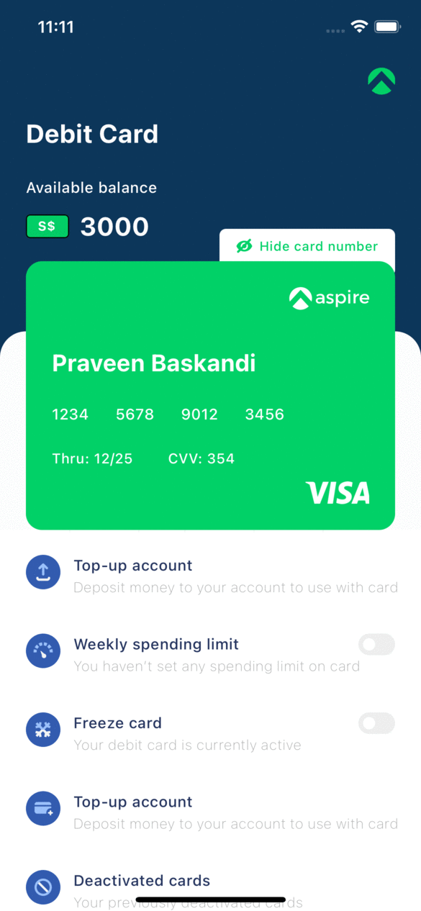
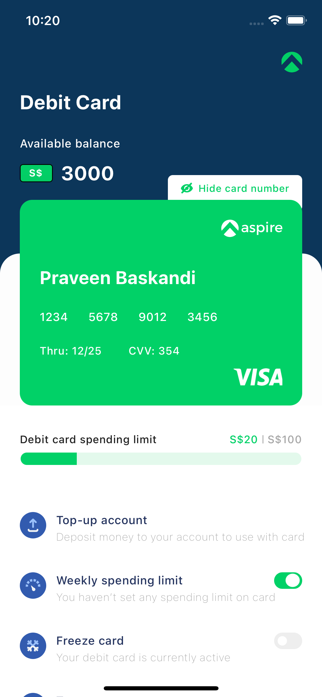
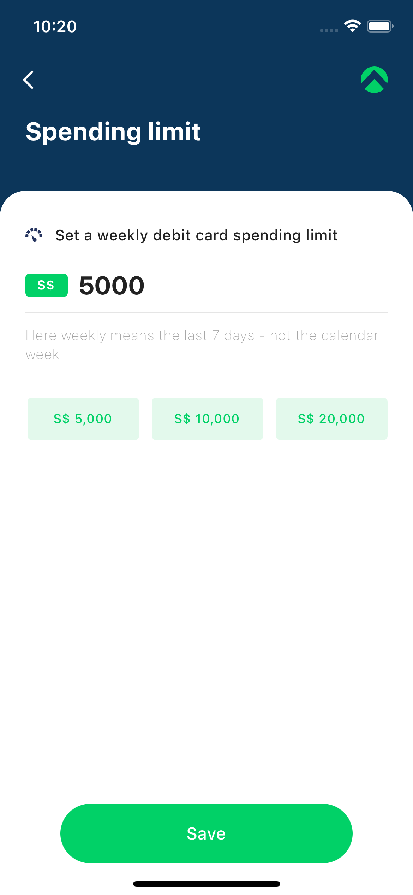

# AspireDemo

Based on:

- [React 17](https://reactjs.org)
- [React Native 0.65](https://reactnative.dev)
- [Redux](https://redux.js.org)
- [React Navigation](https://reactnavigation.org/docs/getting-started/)

## Getting started

- Install [yarn](https://classic.yarnpkg.com/en/docs/install): `npm i -g yarn`
- Install dependencies: `yarn`
- iOS-specific:
  - update pod files `cd ios && pod update`
  - move back and run `npx react-native run-ios`

## Running

- IOS Simulator - `npx react-native run-ios`
- Android Simulator - `npx react-native run-android`

## Screen Shot

### Debit card screen

- This image show the debit card screen
- API will featch some debit card data that will show data from debit card.
- API response:-  
{
  "success": true,
  "data": {
    "cardDetails": {
      "name": "Praveen Baskandi",
      "cardNumber": "1234567890123456",
      "date": "12/25",
      "cvv": "354"
    },
    "spendData": {
      "amount": 54
    }
  }
}
- Screen card is scrollable.
- Hide button will hide and unhide card number and card CVV.
- Progress will show in case of spending limit predefault set
- Weekly spending button click will move to spending limit screen.

### Spending Limit screen

- This image show credit limit screen.
- 3 button with default amount to choose from click on any of the button will set the spending limit to Input Text.
- We can also edit the spending limit.
- Save button will enable and disable accoding to data set.
- Save button click will save data and show it in debit screen and close the screen.
- Back button will back screen without any changes.

